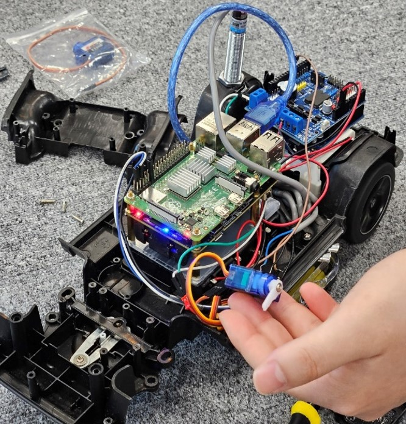
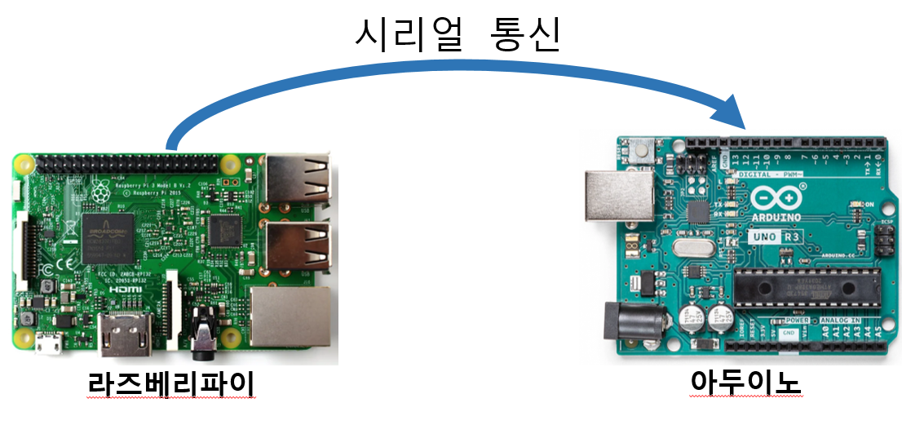
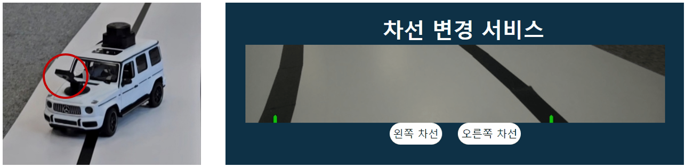
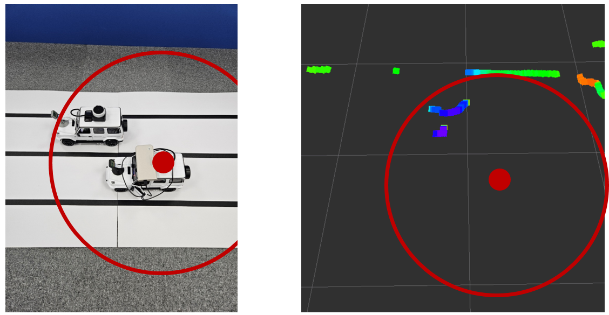
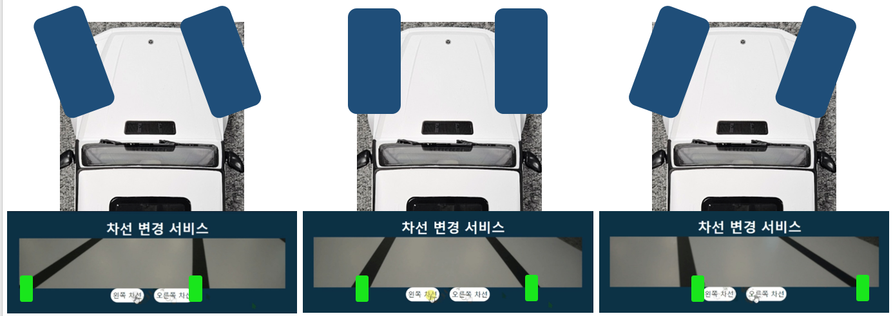
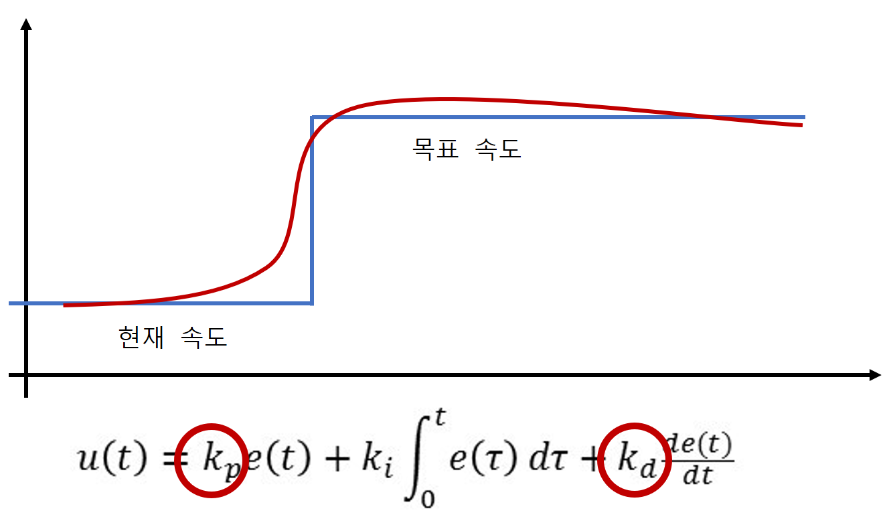
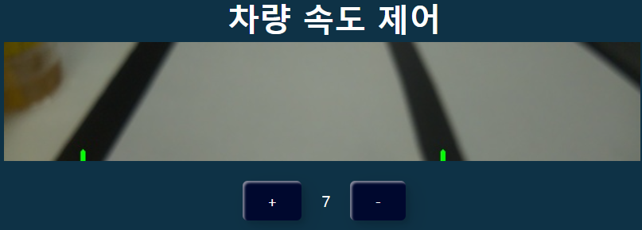
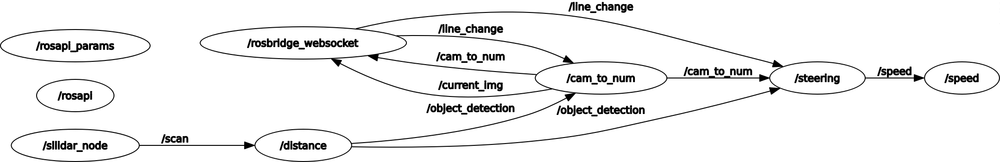
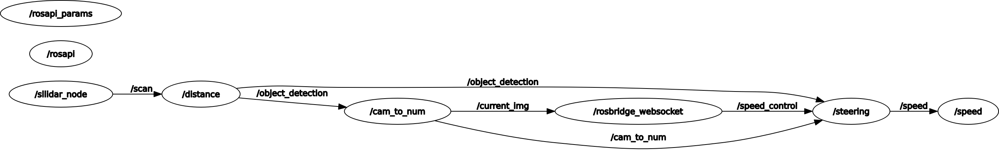

# D110 와리가리팀

## 개요
- RC카를 이용하여 3단계 조건부 자동화 자율 주행 시스템 중 차선 변경 기술 구현을 목표로 프로젝트를 진행하였습니다.

- 고속도로 주행 시, 주변 차량과의 거리를 인지하여 속도를 조절함으로써 안정적이고 안전한 차선 변경을 수행할 수 있습니다.

## 주요 기능
1. 차선 변경
- 운전자가 왼쪽 또는 오른쪽으로 차선변경을 하고 싶을 때 신호를 보내면 안전거리가 확보 되었으면 차선 변경 진행
- 만약 전측면이나 측면에 차량이 위치하거나 후방에서 빠르게 차가 접근하고 있으면 감속후 차선 변경 진행

2. ACC (어댑티브 크루즈 컨트롤)
- 상대 차량이 전방(일정거리 이내)에 있을 때 감속
- 상대 차량이 후방(일정거리 이내)에서 빠르게 접근할 때 가속

3. 조향 시스템
- 기존 RC의 DC 모터된 조향을 서보모터로 교체하여 조향 제어

4. 속도 제어
- 근접센서를 이용해 차량바퀴의 회전수를 측정하여 가속 및 감속 판단
- 바퀴 회전수 기반으로 한 PD 제어

## 시연 영상
### 주행
    
### 차선 변경 

### 감속

### 가속

### [H/w] RC카

### [H/w] 라즈베리파이 & 아두이노

### [인지] 카메라

### [인지] 라이다

### [제어] 조향각

### [제어] PID

### [웹] 웹 소켓을 이용한 차선 변경

- ROS 환경 내에서 rosbridge_server 패키지를 실행하여 socket 통신을 시작하고 Web에서 roslib 라이브러리를 통해 ROS와 socket 통신이 이루어지게 함
- ROS 환경에서 데이터 교환에 사용하는 topic 개념이 socket 통신에 적용되기 때문에 신호 교환에 용이함
### [웹] 웹 소켓을 이용한 차량 속도 제어

### [모듈] 조향 시스템
### [모듈] 어댑티드 크루즈 컨트롤
### [모듈] 차선 변경 로직

### [ROS 구조도] 차선 변경 신호를 받았을 때
 
### [ROS 구조도] 속도 제어 신호를 받았을 때
 
### 개발 환경
> * **Front-end**
> 	* Node.js: 20.11.1
> 	* Vue.js: 3.4.21
> * **Self-driving**
> 	* H/W : RC카, 아두이노 우노, 라즈베리파이-4b (8GB)
>   * sensor : 카메라모듈, slamtec RPLidar C1, 근접센서
> 	* Python : 3.8.10
>       * openCV
> 	* Debian version: 11 (bullseye)
> 	* ROS2 : Humble

### 팀원 소개
---
    ❤️ 이지연: 팀장, 제어, 웹
    🧡 김준수: 제어, 웹, socket통신
    💛 양원석: 인지(카메라), 제어
    💚 전인구: 인지(라이다), 제어
    💙 이재평: H/W 제작 및 트랙 제작, UCC
    💜 송민석: H/W 제작 및 트랙 제작, 주행 테스트
